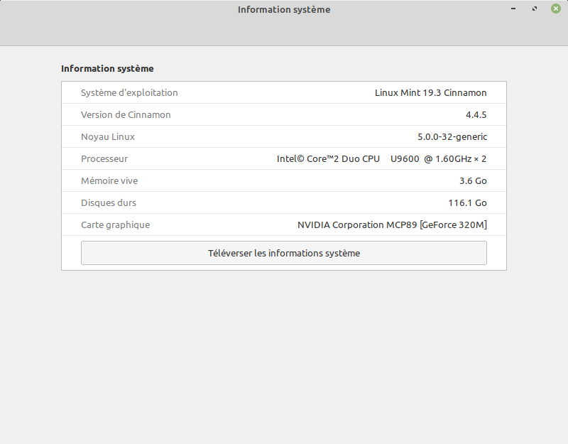
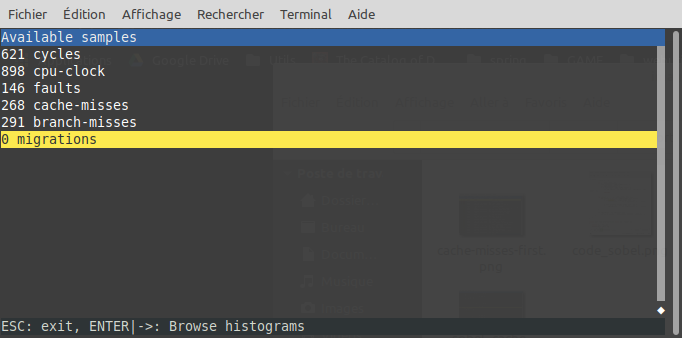
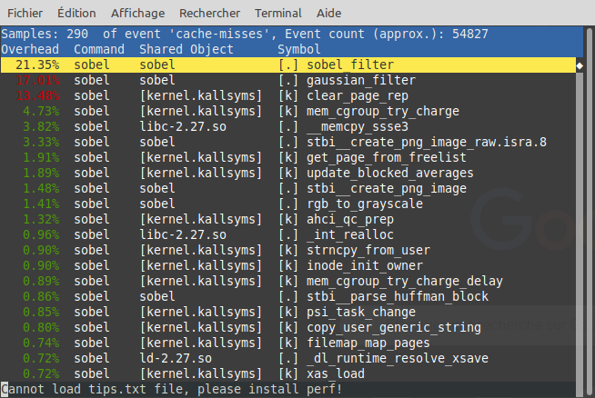
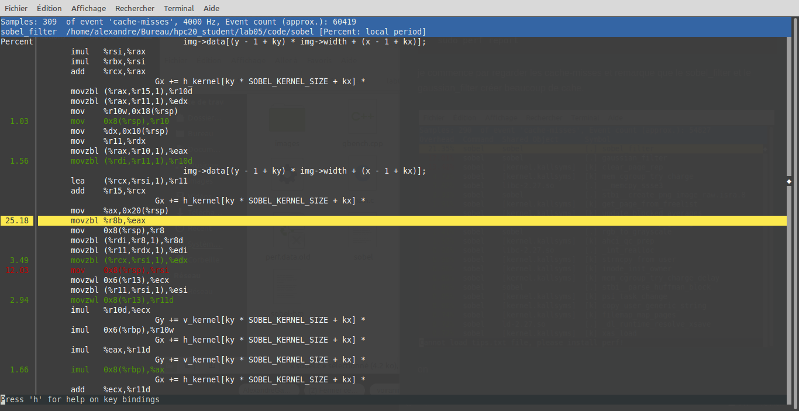
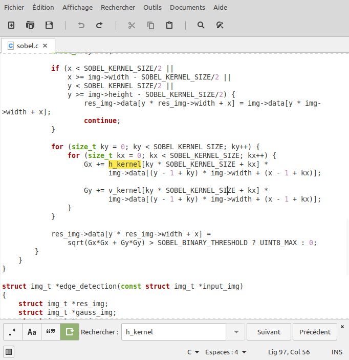
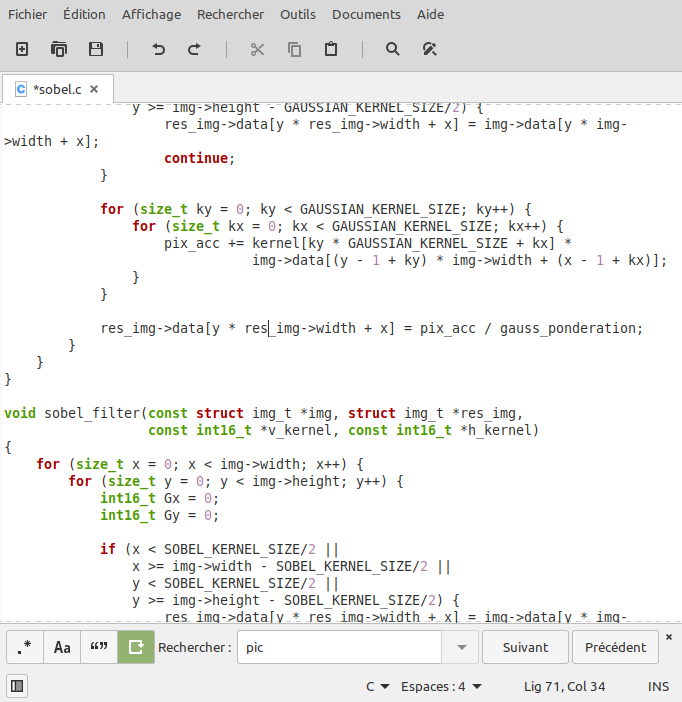

# laboratoire 5 

### auteur : Alexandre Gabrielli

### date : 18 mai 2020

### information sur l'environement d'excecution



### première approche 

analyse de performance avec perf :

je lance mon programme avec la commande suivante :

```sh
sudo perf record -e cycles,cpu-clock,faults,cache-misses,branch-misses,migrations ./sobel images/medalion.png images/edge_medailon.png
```

puis analyse les resulltats avec 

```
sudo perf report 
```

et obtiens le resume suivant:  



je commence par regarder les cache-misses et remarque que le sobel_filter et le gaussian_filter créer beaucoup de cahe.



on trouve que deux boucles assez similaire dans gaussian filter et sobel_filter semblent poser quelques problèmes



voici a quoi resemble les boucles incriminé: 





j'essaye donc d'effectuer plus d'opération par boucle dans gaussian comme suit : 

et refait les commandes suivantes afin de voir le resultats : 

```sh
make clean
make all
sudo perf record -e cycles,cpu-clock,faults,cache-misses,branch-misses,migrations ./sobel images/medalion.png images/edge_medailon.png
sudo perf report
```

ils semblerait y avoir une légère amélioration: 


je fait donc la même transformation dans l'autre boucle similaire (dans sobel_filer) : 


je continue a avoir une petit amélioration.

pour une meilleur amélioration je pense qu'il faudrait changer les deux fonctions pour lire ligne par ligne et non colone par colone car cella correspond mieux a la structure de notre mémoire et comme la cache charge la ligne avec autour les lignes avant et après ce serait beaucoup plus efficace. j'ai donc essayer dans cette optique en tranformant les deux fonctions comme suit:

```c++
for (size_t kx = 0; kx < SOBEL_KERNEL_SIZE; kx++) {
    for (size_t ky = 0; ky < SOBEL_KERNEL_SIZE; ky++) {
        Gx += h_kernel[kx * SOBEL_KERNEL_SIZE + ky] *
            img->data[(x - 1 + kx) * img->height + (y - 1 + ky)];
        Gy += v_kernel[kx * SOBEL_KERNEL_SIZE + ky] *
            img->data[(x - 1 + kx) * img->height + (y - 1 + ky)];
    }
}
```

et 

```c++
for (size_t kx = 0; kx < GAUSSIAN_KERNEL_SIZE; kx++) {
    for (size_t ky = 0; ky < GAUSSIAN_KERNEL_SIZE; ky++) {
        pix_acc += kernel[kx * GAUSSIAN_KERNEL_SIZE + ky] *
            img->data[(x - 1 + kx) * img->height + (y - 1 + ky)];
    }
}
```

mais cela a malheuresement fait fail l'image.

### conclusion 

on a pus mettre le doigt sur ce qu'il fallait amélioré mais malheuresement nos lacunnes en c sont beaucoup trop grande pour avoir réussi dans un temps résonnable a modifier le code afin de mettre mieux a profit le cache. 